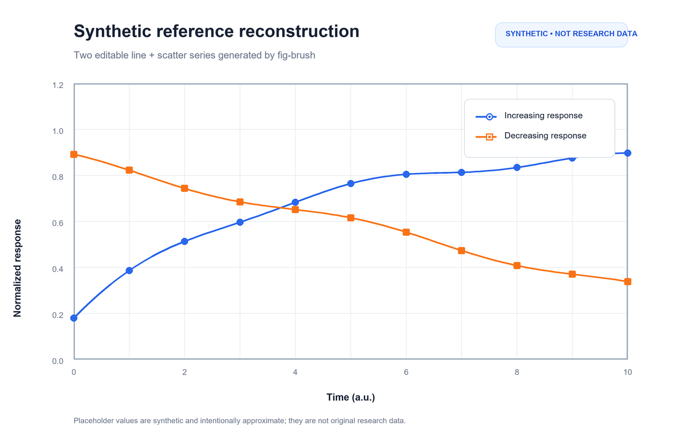

# fig-brush

fig-brush is a Codex plugin and Python package for turning a scientific figure
reference into an editable Origin project. It measures the visible composition
of a screenshot, records a reviewable `TemplateSpec`, and creates an Origin
workbook with clearly labelled visual placeholders that a researcher can
replace with local values.

**Version:** 0.3.1  
**License:** [Apache License 2.0](LICENSE)  
**Maintainer:** Petey Yu



The image above is a synthetic example included for documentation. It does
not represent a paper, an experiment, or recovered research data.

## Workflow

1. Give fig-brush a PNG or JPEG reference figure.
2. Inspect the visible panels, axes, marks, labels, and legend and complete a
   reference-only `TemplateSpec`.
3. Prepare an editable template with placeholder worksheets.
4. Optionally render the template through a locally installed Origin and
   compare a PNG/SVG preview with the reference.
5. Replace the placeholders with your own values in Origin and refit derived
   traces using your own scientific method.

The generated values are visual placeholders. They preserve visible ranges,
marker counts, and layout cues; they are **not** the original measurements or
the original paper's statistical results. A smooth line is treated as a
candidate reconstruction hypothesis unless the user supplies evidence for its
model.

## Quick start on Windows

Requirements:

- Windows 10 or 11;
- Python 3.10 or newer;
- Origin 2021 or newer with a valid local license for native `.opju` rendering;
- the `originpro` package installed in the same environment when native
  rendering is needed.

From the repository root, run the setup script. It creates `.venv` and
installs the local `fig-brush` package (use `-Dev` to include test and build
dependencies):

```powershell
.\scripts\setup.ps1
# or: .\scripts\setup.ps1 -Dev
```

To install a published GitHub release, download the matching
`fig-brush-<version>.zip` asset and its `.sha256` sidecar, extract the archive,
open the extracted `fig-brush` directory, and run the same setup script. Keep
the extracted directory in place while the local Codex plugin is enabled;
the MCP configuration starts its project-local launcher.

Run the synthetic example without Origin:

```powershell
.\.venv\Scripts\python.exe examples\synthetic\run_example.py
```

The optional `--render-origin` flag asks the local Origin bridge to create a
native project. It requires a working Origin installation and `originpro` in
`.venv`:

```powershell
.\.venv\Scripts\python.exe examples\synthetic\run_example.py --render-origin
```

For a local Codex/MCP installation, configure the plugin from this checkout.
The repository `.mcp.json` starts `scripts/run_mcp.ps1`, which uses the
checkout's `.venv` rather than a global Python installation. The setup script
must be run first.

Install the third-party `originpro` package according to the package's
supported distribution instructions when native Origin automation is needed.
fig-brush does not bundle Origin, OriginLab software, or the `originpro`
package.

## What fig-brush can and cannot infer

fig-brush can preserve visible page and plot-frame geometry, axis scales and
ticks, typography and rich text, legends, common line/scatter/column,
histogram, box/violin, heatmap, pie/doughnut, and regression structures. It
also supports explicit candidate fits such as linear, Boltzmann, and 4PL when
the caller requests them.

It is a rendering bridge, not a universal scientific-figure recognizer. A
screenshot alone does not establish the original numbers, fit algorithm,
normalization, significance test, uncertainty definition, or domain meaning.
Automatic OCR, marker/legend segmentation, and reliable reconstruction of
arbitrary 3-D, contour, survival, broken-axis, dark-theme, or complex
multi-panel figures are outside the current boundary. See
[`docs/capabilities.md`](docs/capabilities.md) for the maintained capability
matrix.

## Data handling and privacy

The screenshot-template workflow does not upload a private dataset and does
not require one: it creates synthetic placeholder values from the visible
reference. The screenshot and tool results may still be processed by the
Codex host/model according to that host's policies, so this project should not
be described as universally offline. Review your host's data controls before
using sensitive images.

The generated workbook is intended for local replacement. An older
compatibility/data-inspection tool can read a CSV or XLSX path explicitly
provided by the user; that path is not read by the screenshot-only template
workflow. Do not commit private CSV, XLSX, PNG, PDF, or `.opju` files.

## Documentation

- [Installation and MCP setup](docs/installation.md)
- [Scientific reconstruction contract](docs/scientific-reconstruction.md)
- [Capability matrix and known limits](docs/capabilities.md)
- [Supported graph families](docs/supported_graphs.md)
- [Text layout](docs/text-layout.md)
- [Error bars](docs/error-bars.md)
- [Candidate confidence bands](docs/confidence-bands.md)
- [Troubleshooting](docs/troubleshooting.md)

## Development

```powershell
.\scripts\setup.ps1 -Dev
.\.venv\Scripts\python.exe -m pytest
python scripts\package_plugin.py
```

The package exposes the `fig-brush` command and the `python -m fig_brush`
entry point. CI validates the manifest, runs the Python tests, and builds the
plugin archive.

## License and third-party software

fig-brush source and documentation are released under Apache-2.0. Origin and
OriginLab products are third-party commercial software and require their own
license. `originpro` is a separately distributed third-party Python package;
consult the terms shipped with the version you install. See
[`NOTICE`](NOTICE) and [`THIRD_PARTY_NOTICES.md`](THIRD_PARTY_NOTICES.md).
fig-brush is an independent project and is not affiliated with OriginLab,
OpenAI, or Codex.

## Citation

If fig-brush contributes to published work, cite the metadata in
[`CITATION.cff`](CITATION.cff).
